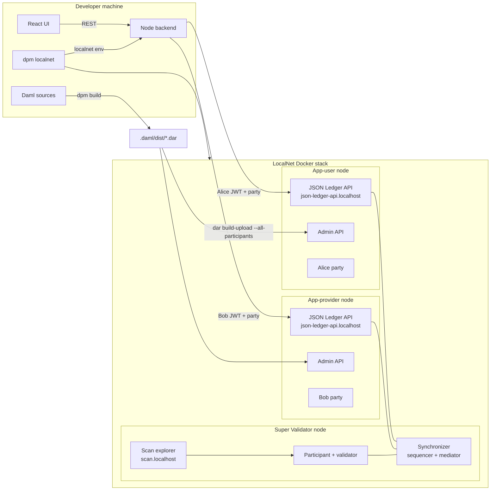

# Plan 1: IOU Daml Demo (JSON Ledger API)

**Status:** Parked  
**Overview:** Bootstrap a minimal Canton app in the canton-devkit-demo-project repo: a multi-party IOU Daml contract, thin TypeScript backend, React frontend, and a README-driven workflow centered on canton-devkit LocalNet lifecycle (up → env → dar build-upload → develop → test → down).

## Implementation checklist

- [ ] Create daml.yaml, .gitignore, Makefile, feature branch feat/demo-app
- [ ] Implement Iou.daml (IOU + TransferProposal) and Test.daml daml-script
- [ ] Build Node/TS backend with JSON Ledger API v2 client and REST routes
- [ ] Build React/Vite UI: mint, list, propose, accept/reject
- [ ] Add scripts/dev.sh and scripts/test-localnet.sh orchestration
- [ ] Add .github/workflows/localnet-tests.yml from canton-devkit CI pattern
- [ ] Write comprehensive README showcasing canton-devkit dev/test workflow

## Goal

Turn [canton-devkit-demo-project](https://github.com/bitdynamics-ab/canton-devkit-demo-project) from an empty stub into a **small, teachable Canton app** that showcases the [canton-devkit](https://github.com/bitdynamics-ab/canton-devkit) LocalNet workflow — without the size/complexity of [cn-quickstart](https://github.com/digital-asset/cn-quickstart) (no Pekko/Spring, OAuth, PQS, licensing workflows, or multi-package monorepo).

The demo should answer: *"How do I write Daml, run it on LocalNet with canton-devkit, connect an app, and test it?"*

## What we are NOT building

| cn-quickstart has | This demo skips |
|---|---|
| App-provider onboarding, licensing, wallet OAuth | Pre-provisioned `app-user` / `app-provider` parties from LocalNet |
| PQS + Postgres indexing | Query active contracts via JSON Ledger API only |
| Token Standard / Amulet flows | Plain Daml templates (can link to devkit `token` commands separately) |
| Nix, multi-service orchestration | `dpm localnet` + a Makefile/`scripts/dev.sh` |

## Architecture



**LocalNet nodes** (all three brought up by `dpm localnet up`):

| Node | Role in this demo |
|---|---|
| **App-user** | Alice's participant — mint IOU, propose transfer via JSON Ledger API |
| **App-provider** | Bob's participant — list pending proposals, accept/reject via JSON Ledger API |
| **Super Validator** | Runs the synchronizer (sequencer + mediator) and Scan explorer; not exercised by the IOU contract flow directly, but coordinates cross-participant transactions between Alice and Bob |

**Parties:** Alice = `app-user` party on the app-user node; Bob = `app-provider` party on the app-provider node. Both exported by `dpm localnet env demo --include-jwt`. No custom party allocation step.

A transfer from Alice to Bob is a cross-participant workflow on the shared synchronizer — closer to production than routing both personas through one node.

## Proposed repo layout

```
canton-devkit-demo-project/
├── daml.yaml                         # sdk 3.5.6, canton-devkit OCI component
├── daml/
│   ├── Iou.daml                      # IOU + TransferProposal templates
│   └── Test.daml                     # daml-script smoke test
├── backend/
│   ├── package.json
│   ├── src/
│   │   ├── index.ts                  # Express/Fastify server
│   │   ├── ledger.ts                 # JSON Ledger API v2 client
│   │   └── config.ts                 # reads CANTON_* env vars
│   └── test/
│       └── iou.integration.test.ts   # runs against live LocalNet
├── frontend/
│   ├── package.json
│   ├── vite.config.ts
│   └── src/
│       ├── App.tsx                   # party switcher + IOU actions
│       └── api.ts                    # calls backend only (no JWT in browser)
├── scripts/
│   ├── dev.sh                        # one-shot: up → env → build-upload → start apps
│   └── test-localnet.sh              # CI-style: up → test → down
├── .github/workflows/localnet-tests.yml  # adapted from canton-devkit examples
├── .gitignore
├── Makefile                          # thin wrappers: up, down, build, test, dev
└── README.md                         # primary showcase artifact
```

## Daml contract design

A **classic IOU with propose/accept transfer** — maps directly to Canton appdev concepts (templates, choices, signatories, multi-party authorization) from [M3 Contract Templates](https://docs.canton.network/appdev/modules/m3-contract-templates) and [M2 Multi-Party Workflows](https://docs.canton.network/appdev/modules/m2-multi-party-workflows).

**Templates in `daml/Iou.daml`:**

1. **`Iou`** — `issuer`, `owner`, `amount`, `currency`; signatory `issuer` + `owner`; choice `ProposeTransfer` creates a `TransferProposal`.
2. **`TransferProposal`** — `issuer`, `owner` (sender), `newOwner`; signatory `owner`; observer `newOwner`; choices `Accept` (archives proposal, creates new `Iou` for recipient) and `Reject` (archives only).

This is ~60 lines of Daml, exercises create + exercise + multi-party visibility, and gives the UI four clear actions: **mint IOU**, **list IOUs**, **propose transfer**, **accept/reject**.

**`daml.yaml` essentials** (Canton/Daml SDK 3.5.6 + canton-devkit OCI component):

```yaml
sdk-version: 3.5.6
name: canton-devkit-demo
version: 0.1.0
source: daml
dependencies:
  - daml-prim
  - daml-stdlib
  - daml-script
components:
  - oci://ghcr.io/bitdynamics-ab/canton-devkit:v0.7
```

**`daml/Test.daml`:** `daml-script` that creates an IOU, proposes transfer, accepts — runnable via `dpm test` without LocalNet (fast unit loop).

## Backend (Node + TypeScript)

Thin REST API that **holds JWTs server-side** and talks to the JSON Ledger API v2 ([API reference](https://docs.canton.network/sdks-tools/api-reference/json-api)).

| Endpoint | Ledger action |
|---|---|
| `GET /api/iou?party=alice\|bob` | `GET /v2/state/active-contracts` filtered to `Iou` / `TransferProposal` |
| `POST /api/iou` | `CreateCommand` for `Iou` |
| `POST /api/iou/:cid/transfer` | `ExerciseCommand` `ProposeTransfer` |
| `POST /api/proposal/:cid/accept` | `ExerciseCommand` `Accept` |
| `POST /api/proposal/:cid/reject` | `ExerciseCommand` `Reject` |
| `GET /health` | readiness probe |

**Config from devkit env:**

Each party persona connects to **its own participant's JSON API**:

| Persona | Party env var | JSON API port | JWT |
|---|---|---|---|
| Alice | `CANTON_APP_USER_PARTY` | `CANTON_PARTICIPANT_JSON_APP_USER_PORT` | `CANTON_APP_USER_JWT` |
| Bob | `CANTON_APP_PROVIDER_PARTY` | `CANTON_PARTICIPANT_JSON_APP_PROVIDER_PORT` | `CANTON_APP_PROVIDER_JWT` |

Host header: `json-ledger-api.localhost` (required; bare `localhost` returns HTML per devkit docs).

The backend routes each request to the correct participant based on the `?party=alice|bob` query param (or equivalent header). Alice's commands use `actAs: [CANTON_APP_USER_PARTY]` on the app-user JSON API; Bob's accept/reject uses `actAs: [CANTON_APP_PROVIDER_PARTY]` on the app-provider JSON API.

**DAR deployment:** upload to both participants so each can interpret the template:

```bash
dpm localnet dar build-upload --project . --instance demo --all-participants
```

Optional later enhancement: `dpm codegen-js` for typed template IDs; v1 can use `#canton-devkit-demo:Iou:Iou` string IDs from `dpm damlc inspect-dar`.

## Frontend (React + Vite)

Single-page demo UI:

- Party toggle (Alice / Bob) — switches which backend persona is used
- **Mint IOU** form (amount, currency)
- **My IOUs** table with "Transfer to…" action
- **Pending proposals** table (incoming transfers) with Accept / Reject
- Link-out to devkit UIs: `dpm localnet status demo` endpoints for Scan explorer and wallet UI

Keep styling minimal (plain CSS); focus on clarity for workshops.

## Developer workflow (README centerpiece)

Document both install paths from canton-devkit docs:

```bash
# Prerequisites: Docker, DPM, ~8 GB Docker RAM
dpm install package
dpm localnet doctor

# Start LocalNet (blocks until healthy)
dpm localnet up demo

# Export connection info
eval "$(dpm localnet env demo --include-jwt)"

# Build + deploy Daml
dpm build
dpm localnet dar build-upload --project . --instance demo

# Run app
make dev    # backend :3001, frontend :5173

# Iterate on Daml (separate terminal)
dpm localnet dar watch --project . --instance demo

# Inspect ledger
dpm localnet contracts watch demo
dpm localnet tx ls demo --party "$CANTON_APP_USER_PARTY"

# Teardown
dpm localnet down demo
```

Also document standalone `canton-devkit` binary as a drop-in alias.

**Hot-deploy loop:** edit Daml → `dar watch` auto-rebuilds → refresh UI.

**Observability hooks** (optional README section): `dpm localnet ui`, Scan UI URL from `status`, `dpm localnet dar info` / `dar diff` for SCU teaching moment.

## Testing strategy

| Layer | What | When |
|---|---|---|
| Daml script | `daml/Test.daml` | `dpm test` — no Docker, fast |
| Integration | `backend/test/iou.integration.test.ts` | Against running LocalNet; full create→transfer→accept across both participants |
| CI | `.github/workflows/localnet-tests.yml` | GitHub Actions job on `ubuntu-latest`; see below |
| Local mirror | `scripts/test-localnet.sh` | Same beats as CI, runnable on a dev machine |

### CI workflow (`.github/workflows/localnet-tests.yml`)

Adapted from [canton-devkit's CI example](https://github.com/bitdynamics-ab/canton-devkit/blob/main/examples/ci/github-actions.yml). Runs on every push/PR to the demo repo.

**What it does:** spin up a throwaway LocalNet on a GitHub-hosted runner, run tests against it, tear down — even if tests fail.

**Job steps:**

1. **Checkout** the demo repo
2. **Install canton-devkit** — download pinned release tarball (`DEVKIT_VERSION: v0.7`), verify SHA256SUMS, put binary on PATH
3. **`localnet doctor`** — fail fast if Docker/Compose/memory isn't ready (GitHub `ubuntu-latest` has Docker; needs ~8 GB RAM for Splice stack)
4. **`localnet up --name ci --version <SPLICE_VERSION>`** — start LocalNet; **blocks until healthy** (typically 1–5 min on cold start). No `sleep` — if the stack isn't ready, the step exits non-zero and the job fails
5. **`localnet env --name ci --format github-env >> $GITHUB_ENV`** — export all `CANTON_*` ports, party IDs, JWTs into the job environment for subsequent steps
6. **Build + deploy Daml** — `dpm build` then `dpm localnet dar build-upload --project . --instance ci --all-participants`
7. **Run tests:**
   - `dpm test` (daml-script; fast, validates contract logic)
   - `npm test` in `backend/` (integration test: Alice mints on app-user → proposes transfer → Bob accepts on app-provider)
8. **Teardown (`if: always()`)** — `localnet clean --name ci --force` so failed runs don't leave dangling containers/volumes on the runner

**Pinned versions** (reproducibility):

```yaml
env:
  DEVKIT_VERSION: v0.7
  SPLICE_VERSION: "0.6.4"   # from `canton-devkit localnet versions`
  INSTANCE: ci
```

**Why cold start matters:** step 4 is the long pole (~1–5 min first run on a clean runner). The plan relies on `localnet up`'s built-in readiness wait — not a manual timeout or sleep — so tests never race a half-started stack. README and CI comments should set this expectation.

`scripts/test-localnet.sh` mirrors the same beats locally for workshop facilitators who want to dry-run the CI path before pushing.

## README structure

1. **What this is** — demo app for canton-devkit LocalNet (link to dev-fund proposal PR)
2. **Prerequisites** — Docker, DPM, resources
3. **Quick start** — 5-minute path to UI showing a transfer
4. **Project tour** — Daml / backend / frontend responsibilities
5. **Develop & test loop** — build, upload, watch, contracts/tx inspection
6. **Canton concepts map** — short table linking IOU flow to M2/M3 ideas (party, template, choice, propose/accept)
7. **CI** — how GitHub Actions runs against throwaway LocalNet
8. **Troubleshooting** — pointer to `localnet doctor`, common port/memory issues
9. **Going further** — cn-quickstart, token faucet (`dpm localnet token`), Canton appdev docs

## Implementation order

1. **Scaffold** — `daml.yaml`, `.gitignore`, Makefile, branch `feat/demo-app` off `origin/main`
2. **Daml** — `Iou.daml` + `Test.daml`; verify `dpm test`
3. **Backend** — ledger client + REST routes; manual curl verification against LocalNet
4. **Frontend** — UI wired to backend
5. **Scripts** — `scripts/dev.sh`, `scripts/test-localnet.sh`
6. **CI** — GitHub Actions workflow
7. **README** — full walkthrough with screenshots placeholders / terminal output examples

## Key references

- [canton-devkit getting started](https://github.com/bitdynamics-ab/canton-devkit/blob/main/docs/getting-started.md)
- [canton-devkit CI example](https://github.com/bitdynamics-ab/canton-devkit/blob/main/examples/ci/github-actions.yml)
- [JSON Ledger API v2](https://docs.canton.network/sdks-tools/api-reference/json-api)
- [M2 concept translation](https://docs.canton.network/appdev/modules/m2-concept-translation)
- [Plan 2: Wallet SDK demo](./plan-2-wallet-sdk-demo.md)

## Risks and mitigations

| Risk | Mitigation |
|---|---|
| JSON API host header | Always use `json-ledger-api.localhost:<port>` in backend client |
| Package ID in templateId | Run `dar info` after first upload; document `#package:Module:Template` pattern; consider small startup helper that reads package id from `dar list` |
| LocalNet cold start time (~minutes) | README sets expectations; CI uses `localnet up` blocking wait (no sleep) |
| Cross-participant visibility | Alice (app-user) and Bob (app-provider) are on separate participants. `TransferProposal` uses `observer newOwner` so Bob can see pending proposals on his participant. If accept fails due to visibility, verify DAR is uploaded to both participants (`--all-participants`) and that `newOwner` is Bob's real party id from `localnet env` |
| DAR only on one participant | Always use `--all-participants` on upload/watch; document in README |
