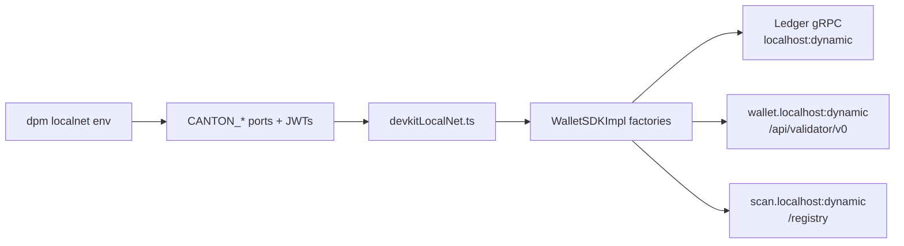

# Plan 2: Wallet SDK Demo for canton-devkit LocalNet

**Status:** Parked (alternative to Plan 1)  
**Overview:** A TypeScript Wallet SDK showcase that uses canton-devkit for LocalNet lifecycle, with a devkit-aware config bridge for dynamic ports, step-by-step scripts for external party + Amulet transfers, and an optional minimal React wallet UI.

## Implementation checklist

- [ ] Scaffold wallet-demo/ TypeScript package + daml.yaml (devkit component only, no Daml sources)
- [ ] Implement devkitLocalNet.ts config bridge mapping CANTON_* env to Wallet SDK factories
- [ ] Implement scripts 01-06: create wallet, fund, UTXOs, transfer, accept, tx history
- [ ] Add wallet-up.sh / wallet-demo.sh orchestrators and check-config validation
- [ ] Add vitest integration test + GitHub Actions wallet-localnet.yml CI
- [ ] (Optional) Express proxy + minimal React wallet UI
- [ ] Write README covering Plan 1 vs Plan 2, devkit workflow, and Wallet SDK walkthrough

## Goal

Show how to build a **wallet integration** on Canton using [@canton-network/wallet-sdk](https://docs.canton.network/sdks-tools/sdks/wallet-sdk), with **canton-devkit** providing the LocalNet infrastructure — without cn-quickstart's `make start`, without custom Daml, and without the complexity of a full App-Provider stack.

**Audience:** Wallet providers, exchanges, integrators, and workshop participants who need to understand external party creation, Amulet (CIP-0056) transfers, UTXO queries, and the prepare-sign-submit flow.

## Plan 1 vs Plan 2

| | Plan 1 (parked) | Plan 2 (this plan) |
|---|---|---|
| **Teaches** | Write & deploy your own Daml | Integrate with Canton tokens via Wallet SDK |
| **Ledger access** | JSON Ledger API v2 (raw HTTP) | Wallet SDK (`WalletSDKImpl`) |
| **Custom Daml** | Yes (IOU templates) | No — uses on-ledger Amulet from Splice onboarding |
| **Parties** | Pre-provisioned app-user / app-provider | External wallet party + existing funded roles |
| **Frontend** | React app over custom REST API | Optional React wallet dashboard over SDK |
| **Best for** | Daml developers | Wallet / token integrators |

Both plans can coexist in the same repo as sibling directories (`iou-demo/` and `wallet-demo/`) or as separate branches.

## Core technical challenge: port mapping

Wallet SDK's built-in [localNetStaticConfig](https://docs.canton.network/reference/typescript/wallet-sdk) assumes **cn-quickstart fixed ports** (`wallet.localhost:2000`, ledger at known offsets, etc.).

canton-devkit assigns **dynamic host ports** by default and exports them via `localnet env`. The nginx vhost routing (`wallet.localhost`, `scan.localhost`, `json-ledger-api.localhost`) is the same Splice LocalNet stack — only the port numbers differ.

**Plan 2's key deliverable:** a small `devkitLocalNet.ts` config bridge that reads `CANTON_*` env vars and builds custom Wallet SDK factories instead of using `localNetStaticConfig` blindly.



**Env vars to map:**

| Env var | Wallet SDK use |
|---|---|
| `CANTON_PARTICIPANT_LEDGER_APP_USER_PORT` | Ledger gRPC client |
| `CANTON_APP_USER_UI_PORT` | Validator API at `http://wallet.localhost:<port>` |
| `CANTON_SV_UI_PORT` / `CANTON_SCAN_UI_URL` | Scan + token registry (`scan.localhost` vhost) |
| `CANTON_APP_USER_JWT` | Bearer auth (HS256, secret `unsafe`) |
| `CANTON_APP_USER_USER` | Ledger API user id |
| `CANTON_APP_USER_PARTY` | Funded role party (Amulet source for faucet step) |

**Do not** use `localNetAuthDefault` / `localNetLedgerDefault` without the bridge — they will point at wrong ports. Document this explicitly in README as the main difference from cn-quickstart tutorials.

## What we are NOT building

- Custom Daml contracts or `dar upload` (unless a future extension adds a dApp interaction)
- cn-quickstart backend (Pekko/Spring), PQS, Keycloak OAuth
- canton-devkit `localnet token` CLI flows (those target CIP-0112 V2 alpha; Wallet SDK demo uses **CIP-0056 Amulet**)
- Full Wallet Gateway server or browser extension (SDK only; link to [canton-network/wallet](https://github.com/canton-network/wallet) for production wallet gateway)

## Proposed repo layout

```
canton-devkit-demo-project/
├── wallet-demo/                          # Plan 2 root
│   ├── package.json                      # @canton-network/wallet-sdk, typescript, vitest
│   ├── tsconfig.json
│   ├── daml.yaml                         # sdk-version + canton-devkit OCI component only (no daml/ sources)
│   ├── src/
│   │   ├── config/
│   │   │   └── devkitLocalNet.ts         # CANTON_* → SDK factory bridge
│   │   ├── lib/
│   │   │   └── sdk.ts                    # shared connect/bootstrap helper
│   │   └── scripts/
│   │       ├── 01-create-wallet.ts       # createKeyPair + signAndAllocateExternalParty
│   │       ├── 02-fund-wallet.ts         # transfer Amulet from app-user party
│   │       ├── 03-list-utxos.ts          # listHoldingUtxos
│   │       ├── 04-transfer.ts            # createTransfer → prepare → sign → execute
│   │       ├── 05-accept-transfer.ts     # listPendingTransferInstructions + accept
│   │       └── 06-tx-history.ts          # listHoldingTransactions (pagination demo)
│   ├── ui/                               # optional thin React dashboard
│   ├── server/                           # optional express proxy for UI
│   ├── test/
│   │   └── wallet-flow.integration.test.ts
│   └── .env.example                      # documented CANTON_* placeholders
├── scripts/
│   ├── wallet-up.sh                      # doctor → up → env → dotenv
│   └── wallet-demo.sh                    # run scripts 01–06 in sequence
├── .github/workflows/wallet-localnet.yml
└── README.md                             # Plan 2 quickstart (links to Plan 1)
```

`daml.yaml` exists solely to install canton-devkit as a DPM component (`dpm install package` → `dpm localnet …`). No `daml/` source directory.

## Demo narrative (workshop script)

A facilitator runs this ~10-minute flow:

```bash
# 1. Infrastructure (canton-devkit)
dpm install package
dpm localnet doctor
dpm localnet up wallet-demo
eval "$(dpm localnet env wallet-demo --include-jwt)"

# 2. Inspect what devkit brought up
dpm localnet status wallet-demo        # endpoints, parties, ports
dpm localnet ui                        # optional devkit dashboard

# 3. Wallet SDK scripts (from wallet-demo/)
pnpm install
pnpm run demo                          # runs 01→06 sequentially

# 4. Debug alongside
dpm localnet contracts watch wallet-demo
dpm localnet tx ls wallet-demo --party "$CANTON_APP_USER_PARTY"

# 5. Compare with built-in wallet UI
open "$(dpm localnet status wallet-demo --format json | jq -r '.endpoints[] | select(.label|test("app-user")) | .url')"

# 6. Teardown
dpm localnet down wallet-demo
```

### Script details (aligned with [Wallet SDK docs](https://docs.canton.network/sdks-tools/sdks/wallet-sdk))

1. **Create wallet** — `createKeyPair()` + `signAndAllocateExternalParty()` via topology/validator APIs; persist `{partyId, publicKey}` to `.wallet-demo/state.json` (gitignored).
2. **Fund wallet** — Transfer Amulet from `CANTON_APP_USER_PARTY` (pre-funded by Splice onboarding) to the new external party using `tokenStandard.createTransfer` + prepare-sign-submit. This replaces a manual faucet.
3. **List UTXOs** — `listHoldingUtxos(false)`; print holdings with instrument id `Amulet`.
4. **Transfer** — Two-step transfer to `CANTON_APP_PROVIDER_PARTY`; demonstrate prepare → `signTransactionHash` → `executeSubmission`.
5. **Accept** — `listPendingTransferInstructions()` on receiver SDK instance; exercise accept choice.
6. **History** — `listHoldingTransactions(startOffset, step)` with pagination via `nextOffset`.

Adapt patterns from [canton-network/wallet integration guide examples](https://github.com/canton-network/wallet/tree/main/docs/wallet-integration-guide/examples) rather than inventing API usage from scratch.

## Optional React UI (keep minimal)

If included, a single-page wallet dashboard:

- Current Amulet balance (UTXO count + total)
- Send form (recipient party id, amount, memo)
- Pending incoming transfers with Accept / Reject buttons
- "Open Splice Wallet UI" link from `localnet status`

Architecture: browser → Express proxy (`server/`) → Wallet SDK. Private keys and JWTs stay server-side (workshop-safe; mirrors production wallet gateway pattern).

Skip if scope is tight — the script sequence alone is a valid demo.

## `devkitLocalNet.ts` design sketch

```typescript
// Reads process.env after `eval "$(dpm localnet env ... --include-jwt)"`
export function devkitAuthFactory(): AuthController { /* JWT from CANTON_APP_USER_JWT */ }
export function devkitLedgerFactory(): LedgerController { /* localhost:LEDGER_PORT */ }
export function devkitValidatorFactory(): ValidatorController {
  /* http://wallet.localhost:APP_USER_UI_PORT */
}
export function devkitTokenStandardFactory(): TokenStandardController {
  /* registry: scan.localhost:SV_UI_PORT + setTransferFactoryRegistryUrl */
}
export async function connectDevkitSDK(): Promise<WalletSDKImpl> {
  return new WalletSDKImpl().configure({ ... }).connect()
}
```

Add a `pnpm run check-config` script that validates all required `CANTON_*` vars are set and endpoints respond (curl ledger version, scan DSO endpoint) before running wallet scripts.

## Testing

| Layer | Command | Needs Docker |
|---|---|---|
| Config smoke | `pnpm run check-config` | Yes (LocalNet up) |
| Integration | `pnpm test` (vitest) | Yes — runs fund + transfer + accept |
| CI | `.github/workflows/wallet-localnet.yml` | Yes — adapted from canton-devkit CI example |

CI beats: install devkit → doctor → up → `env --format github-env` → `pnpm test` → `localnet clean --force`.

No Daml script tests (no custom Daml).

## README structure (Plan 2)

1. **Two demos in this repo** — link to parked Plan 1 (IOU/Daml) vs this Plan 2 (Wallet SDK)
2. **What you'll learn** — external parties, Amulet transfers, two-step settlement, devkit lifecycle
3. **Prerequisites** — Docker, Node 20+, DPM
4. **Why not `localNetStaticConfig`?** — devkit dynamic ports; use our bridge
5. **Quick start** — `wallet-up.sh` + `pnpm demo`
6. **Script walkthrough** — one section per script with expected output
7. **Canton concepts map** — Wallet SDK ops → M2 table (Party, UTXO, prepare-sign-submit, two-step transfer)
8. **Debugging with devkit** — `status`, `contracts watch`, `tx ls`, built-in wallet UI, `localnet ui`
9. **Production path** — custom OAuth factories, link to [Wallet Configuration](https://docs.canton.network/integrations/wallet/configuration) and Wallet Gateway repo
10. **Troubleshooting** — vhost mistakes (`Host: localhost` → HTML not JSON), missing Amulet (onboarding not complete), Docker memory

## Implementation order

1. Scaffold `wallet-demo/` package + `daml.yaml` with canton-devkit component
2. Implement `devkitLocalNet.ts` config bridge + `check-config` script
3. Implement scripts 01–06; verify manually against live LocalNet
4. Add `scripts/wallet-demo.sh` orchestrator + `.env.example`
5. Add vitest integration test
6. (Optional) Express proxy + minimal React UI
7. CI workflow + README

## Risks and mitigations

| Risk | Mitigation |
|---|---|
| Wallet SDK API drift (`WalletSDKImpl` vs newer `SDK.create`) | Pin `@canton-network/wallet-sdk` version; follow [wallet repo examples](https://github.com/canton-network/wallet/tree/main/docs/wallet-integration-guide/examples) |
| External party has no Amulet | Script 02 explicitly funds from `CANTON_APP_USER_PARTY`; document onboarding wait after `localnet up` |
| `localNetStaticConfig` confusion in docs/tutorials | README callout + `check-config` fails fast with actionable message |
| Two-step transfer demo needs receiver SDK instance | Script 05 connects with app-provider JWT/party for accept side |
| Amulet `instrumentAdmin` party id | Discover at runtime from first UTXO or `localnet status` party listing; don't hardcode |

## Key references

- [Wallet SDK docs](https://docs.canton.network/sdks-tools/sdks/wallet-sdk)
- [Wallet SDK TypeScript reference](https://docs.canton.network/reference/typescript/wallet-sdk) (`localNetStaticConfig` fields)
- [Wallet integration guide examples](https://github.com/canton-network/wallet/tree/main/docs/wallet-integration-guide/examples)
- [CIP-0056 token standard](https://docs.canton.network/appdev/deep-dives/token-standard)
- [canton-devkit getting started](https://github.com/bitdynamics-ab/canton-devkit/blob/main/docs/getting-started.md)
- [Plan 1: IOU Daml demo](./plan-1-iou-daml-demo.md)
